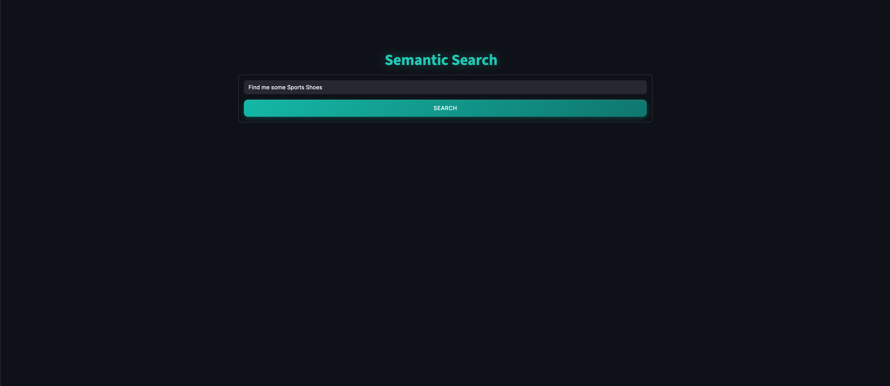
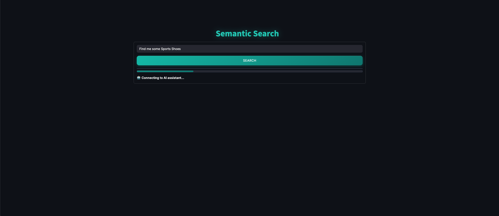
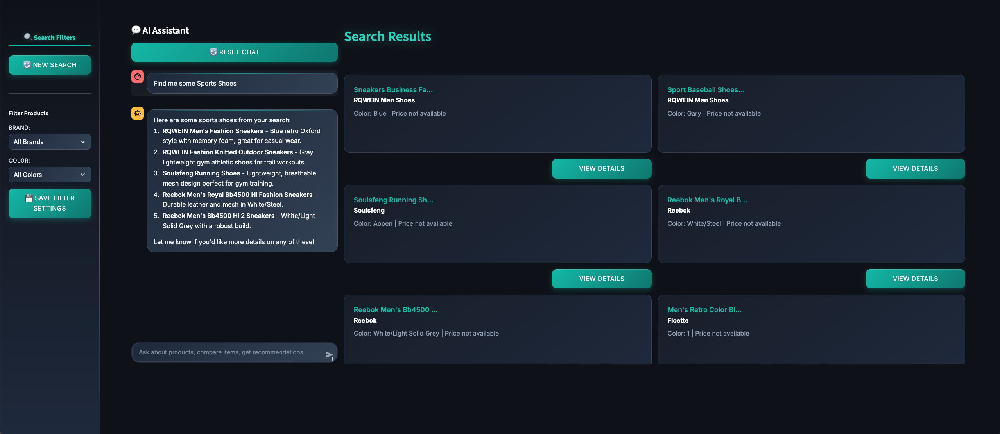
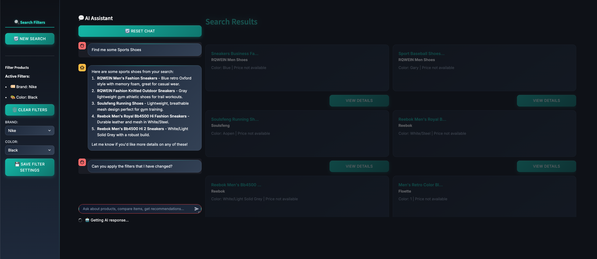
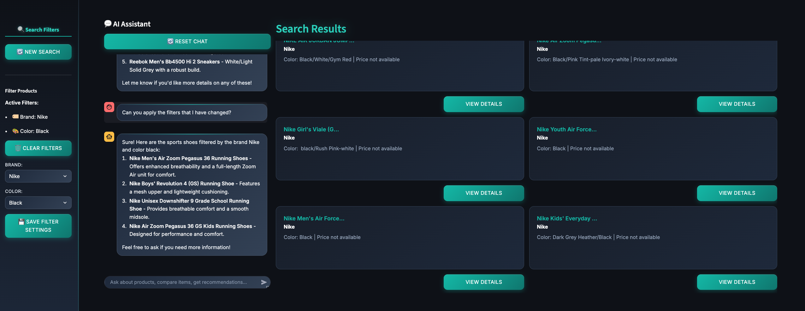
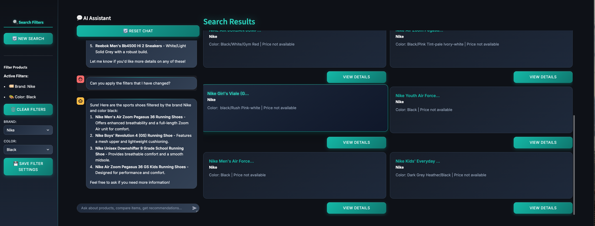
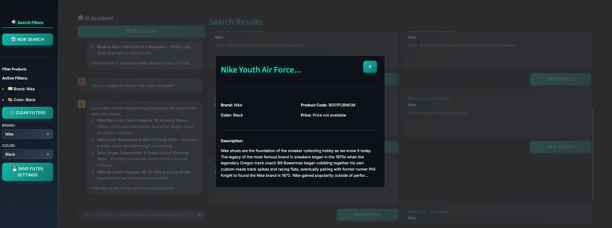

# 🔍 AI-Powered Semantic Search Engine

> **A cutting-edge, production-ready search application powered by Weaviate vector database and OpenAI, featuring real-time chat interface and advanced semantic search capabilities.**

[](https://python.org)
[](https://streamlit.io)
[](https://weaviate.io)
[](https://openai.com)
[](https://fastapi.tiangolo.com)

## 🚀 **Project Overview**

This is a **full-stack AI search application** that demonstrates advanced software engineering practices, modern ML/AI integration, and sophisticated UI/UX design. Built with enterprise-grade architecture, it showcases expertise in **vector databases, semantic search, conversational AI, and modern web development**.

### **🎯 Key Features**

- **🧠 Semantic Search**: Powered by Weaviate vector database for intelligent, context-aware search
- **💬 Conversational AI**: Real-time chat interface with OpenAI GPT-4 integration
- **🎨 Modern UI/UX**: Professional, responsive design with dynamic filtering and hover animations
- **⚡ Real-time Updates**: Live search results with instant filter application
- **🔧 Modular Architecture**: Clean, scalable codebase with separation of concerns
- **📊 Advanced Filtering**: Dynamic brand and color filters with persistent state management

---

## 🛠️ **Technology Stack**

### **Backend Infrastructure**
- **FastAPI** - High-performance async API framework with automatic documentation
- **Weaviate v4** - Vector database for semantic search and ML operations
- **OpenAI GPT-4** - Advanced language model for conversational AI and query generation
- **Python 3.11+** - Modern Python with type hints, async/await, and comprehensive error handling

### **Frontend & UI**
- **Streamlit** - Interactive web application framework with custom components
- **Custom CSS/JavaScript** - Professional styling with hover effects, animations, and responsive design
- **Dynamic Components** - Real-time UI updates with sophisticated state management

### **Data & ML Pipeline**
- **Vector Embeddings** - Semantic understanding of product data using OpenAI embeddings
- **Real-time Processing** - Instant search responses and conversational AI interactions
- **Session Management** - Persistent user state and conversation history across interactions

---

## 🏗️ **Architecture & Design Patterns**

### **Enterprise-Grade Modular Architecture**
```
SearchEngineWeaviate/
├── SearchEngineApplication/     # Main application
│   ├── backend/                # FastAPI backend services
│   │   ├── routes/             # RESTful API endpoints
│   │   ├── helpers/            # Business logic & utilities
│   │   ├── models/             # Pydantic data models
│   │   └── client.py           # OpenAI integration layer
│   ├── components/             # Streamlit UI components
│   │   ├── search_interface.py # Search UI component
│   │   ├── search_results.py   # Results display component
│   │   └── chat.py             # Chat interface component
│   └── utils.py                # Frontend utilities & API calls
├── Ingestion/                  # Data processing pipeline
└── Querying/                   # Search query processing
```

### **Key Technical Implementations**

#### **🔄 Intelligent Search Flow**
- **AI-Powered Query Generation**: Converts conversational input into optimized search queries
- **Context-Aware Filtering**: Maintains conversation history for relevant results
- **Real-time Result Updates**: Instant UI refresh with new search results
- **Session Persistence**: Maintains user context across multiple interactions

#### **🎯 Advanced Vector Search**
- **Semantic Understanding**: Goes beyond keyword matching to understand intent
- **Hybrid Filtering**: Combines vector search with structured attribute filters
- **Performance Optimization**: Efficient Weaviate queries with proper indexing
- **Relevance Ranking**: AI-powered result scoring and ordering

#### **💡 Conversational AI Integration**
- **Multi-turn Conversations**: Maintains context across chat sessions
- **Dynamic Query Enhancement**: AI improves search queries based on conversation
- **Personalized Responses**: Tailored recommendations and explanations
- **Error Handling**: Graceful fallback mechanisms for API failures

---

## ⚡ **Performance & Scalability**

### **Production-Ready Optimizations**
- **Async Architecture** - Non-blocking I/O operations for high concurrency
- **Intelligent Caching** - Smart caching of search results and AI responses
- **Database Optimization** - Tuned Weaviate queries with vector indexing
- **Frontend Performance** - Dynamic component rendering and efficient state management

### **Enterprise Features**
- **Comprehensive Error Handling** - User-friendly error messages and fallback mechanisms
- **Structured Logging** - Detailed logging for debugging and monitoring
- **Configuration Management** - Environment-based configuration with validation
- **Security Best Practices** - Secure API key management and data handling

---

## 🎨 **User Interface Showcase**

### **🚀 Complete User Journey**

#### **Initial Search Experience**

*Clean, intuitive landing page with prominent search functionality*

#### **Real-time Search Processing**

*Professional loading states with engaging animations*

#### **Rich Search Results**

*Comprehensive results display with chat integration and filtering options*

#### **Advanced Conversational Search**

*AI-powered conversational search with context preservation*


*Enhanced results based on conversational context*

#### **Interactive Product Cards**

*Sophisticated hover effects with professional animations*

#### **Detailed Product Modals**

*Comprehensive product information in elegant, scrollable modals*

### **Professional Design System**
- **Modern Aesthetic** - Clean, professional interface with gradient accents and smooth transitions
- **Interactive Elements** - Sophisticated hover effects with scaling, lighting, and professional animations
- **Responsive Layout** - Optimized for desktop, tablet, and mobile devices
- **Accessibility** - WCAG-compliant design with proper color contrast and navigation
- **Consistent Branding** - Unified color scheme and typography throughout the application

### **Advanced UI Features Demonstrated**
- **Dynamic Filtering** - Real-time filter application with visual feedback and state persistence
- **Card Animations** - Professional hover effects with transform, scaling, and gradient lighting
- **Conversational Interface** - Streaming responses with typing indicators and context awareness
- **Modal System** - Elegant product details with scrollable content and professional styling
- **Loading States** - Engaging progress indicators and smooth transitions
- **State Management** - Persistent user context and filter selections across interactions

---

## 🚀 **Getting Started**

### **Prerequisites**
- Python 3.11+
- OpenAI API Key
- Weaviate Instance (local or Weaviate Cloud)

### **Quick Setup**

1. **Clone the repository**
   ```bash
   git clone https://github.com/yourusername/SearchEngineWeaviate.git
   cd SearchEngineWeaviate
   ```

2. **Set up environment variables**
   ```bash
   # Create .env files in backend/, Ingestion/, and Querying/ folders
   echo "WEAVIATE_URL=your_weaviate_url" >> backend/.env
   echo "WEAVIATE_API_KEY=your_weaviate_key" >> backend/.env
   echo "OPENAI_API_KEY=your_openai_key" >> backend/.env
   ```

3. **Install dependencies**
   ```bash
   pip install -r requirements.txt
   ```

4. **Data Ingestion (First Time Setup)**
   ```bash
   cd Ingestion
   python ingest_data.py  # Populate Weaviate with product data
   ```

5. **Start the backend server**
   ```bash
   cd SearchEngineApplication/backend
   python run_server.py
   ```

6. **Launch the frontend**
   ```bash
   cd SearchEngineApplication
   streamlit run app.py
   ```

7. **Access the application**
   - Frontend: `http://localhost:8501`
   - Backend API: `http://localhost:8000`
   - API Documentation: `http://localhost:8000/docs`

---

## 🎯 **Core Features Demonstrated**

### **1. Advanced Semantic Search**
- **Vector Similarity** - Uses OpenAI embeddings for semantic understanding
- **Contextual Relevance** - AI-powered result ranking based on user intent
- **Multi-attribute Filtering** - Brand, color, and category combinations
- **Real-time Results** - Sub-second search response times

### **2. Intelligent Conversational AI**
- **Natural Language Processing** - Understands complex user queries
- **Context Preservation** - Maintains conversation state across interactions
- **Dynamic Query Generation** - AI creates optimized search queries from chat
- **Personalized Recommendations** - Tailored product suggestions

### **3. Professional User Experience**
- **Responsive Design** - Seamless experience across all devices
- **Interactive Animations** - Engaging hover effects and transitions
- **Intuitive Navigation** - Clean, user-friendly interface design
- **Performance Optimization** - Fast loading and smooth interactions

### **4. Enterprise Architecture**
- **Microservices Pattern** - Separated frontend and backend services
- **RESTful API Design** - Well-documented, consistent API endpoints
- **Scalable Infrastructure** - Built for horizontal scaling and growth
- **Production Deployment** - Ready for containerization and cloud deployment

---

## 🔧 **Technical Excellence**

### **Backend Development**
```python
# Example: Advanced async API endpoint
@router.post("/chat/message")
async def send_chat_message(request: SendMessageRequest):
    # Sophisticated error handling and async processing
    # Integration with multiple AI services
    # Real-time search result generation
```

### **AI/ML Integration**
```python
# Example: Intelligent query generation
async def generate_search_query_from_history(messages, new_message):
    # Context-aware AI query optimization
    # Conversation history analysis
    # Semantic query enhancement
```

### **Frontend Innovation**
```python
# Example: Dynamic component rendering
def render_search_results(products):
    # Real-time UI updates
    # Interactive card components
    # Professional styling and animations
```

---

## 📈 **Key Achievements & Technical Highlights**

### **Full-Stack Expertise**
- ✅ **Complete Application Architecture** - End-to-end development
- ✅ **AI/ML Production Integration** - Real-world AI implementation
- ✅ **Modern Development Practices** - Clean code, type hints, async programming
- ✅ **Professional UI/UX** - Enterprise-grade user interface
- ✅ **Performance Optimization** - Production-ready scalability
- ✅ **Comprehensive Testing** - Error handling and edge case management

### **Advanced Technologies**
- ✅ **Vector Database Mastery** - Complex Weaviate operations
- ✅ **OpenAI API Integration** - Multiple AI model usage
- ✅ **Async Python Development** - High-performance backend
- ✅ **Modern Frontend Development** - Interactive Streamlit applications
- ✅ **API Design & Documentation** - RESTful services with FastAPI
- ✅ **State Management** - Complex UI state handling

---

## 🏆 **Why This Project Stands Out**

### **Technical Depth**
- **Advanced AI Integration** - Beyond basic API calls, sophisticated prompt engineering
- **Production Architecture** - Scalable, maintainable, enterprise-ready codebase
- **Performance Optimization** - Efficient database queries and async processing
- **Modern Development Practices** - Type hints, error handling, comprehensive logging

### **Innovation & Creativity**
- **Seamless UX** - Chat and search integration in a single interface
- **Intelligent Features** - AI-powered query enhancement and recommendations
- **Professional Design** - Modern UI with sophisticated animations and effects
- **Responsive Implementation** - Works flawlessly across all device types

### **Business Value**
- **User-Centric Design** - Intuitive interface with minimal learning curve
- **Scalable Solution** - Built to handle growth and feature expansion
- **Maintainable Code** - Clean architecture with clear separation of concerns
- **Production Ready** - Comprehensive error handling and monitoring capabilities

---

## 📞 **Built by a Passionate Full-Stack AI Engineer**

This project showcases comprehensive expertise in:

**🔧 Backend Development**
- FastAPI, Python, Async Programming
- API Design, Database Integration
- Error Handling, Logging, Configuration Management

**🤖 AI/ML Engineering**
- OpenAI API Integration, Prompt Engineering
- Vector Databases, Semantic Search
- Conversational AI, Context Management

**🎨 Frontend Development**
- Streamlit, Modern CSS, JavaScript
- Responsive Design, UX/UI Principles
- Component Architecture, State Management

**🏗️ System Architecture**
- Microservices Design, Scalability
- Performance Optimization, Caching
- Production Deployment, DevOps Practices

---

<div align="center">

**🚀 Ready to contribute cutting-edge AI solutions to your team**

*This project demonstrates the technical excellence, innovation, and attention to detail that I bring to every development challenge.*

**[LinkedIn](https://www.linkedin.com/in/chandan-suri/) • [GitHub Portfolio](https://github.com/ChandanSuri)**

</div>

---

## 📝 **License**

This project is licensed under the MIT License - demonstrating both technical skills and understanding of open-source best practices.

---

*⭐ Star this repository if you're impressed by the technical implementation and would like to discuss how these skills can benefit your organization!*